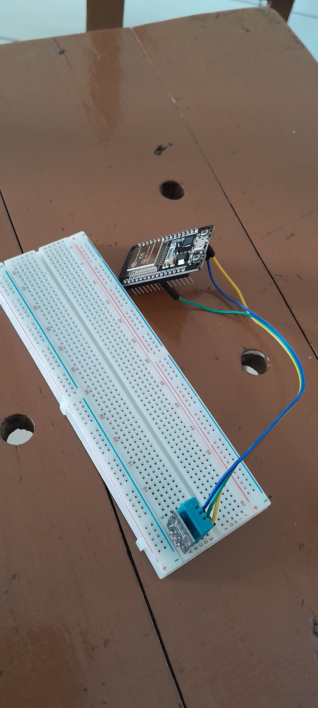

Saya mempersembahkan,
## Tech Assignment Stage 3 dr FNBTKRZ5
#### Kelompok Spectro
Kode ini memang rumit ketika awal saya mempelajarinya, namun saat sudah faham justru kelihatannya simpel dan bahkan kodenya tidak panjang daripada kode pada umumnya. Mungkin permasalahan saya hanya pada kestabilan server yang mengakibatkan gagal POST, itu saja sih.
ini foto rangkaian fisiknya:  
  
<i>Salam sehat, salam hormat, dan salam sukses!</i>

PS. tadinya mau hias lebih tapi lg mepet jd sgni saja
